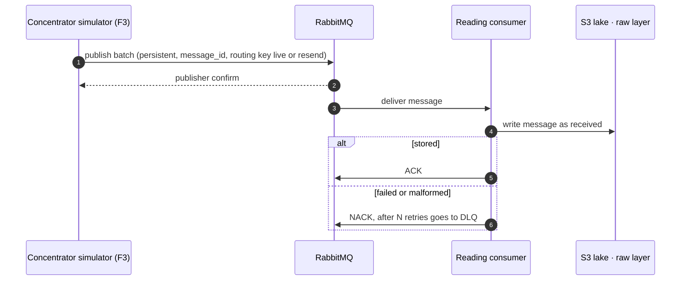
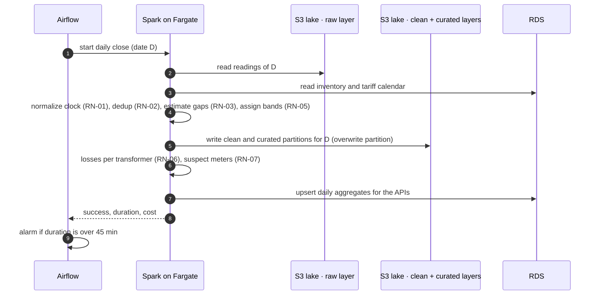
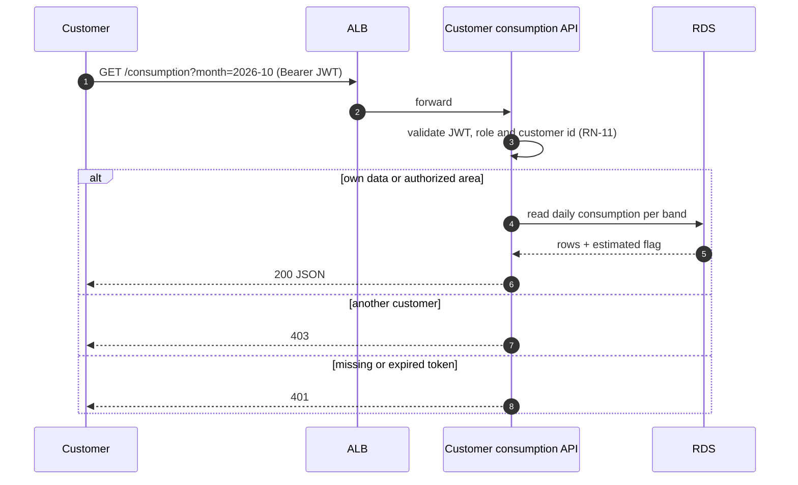
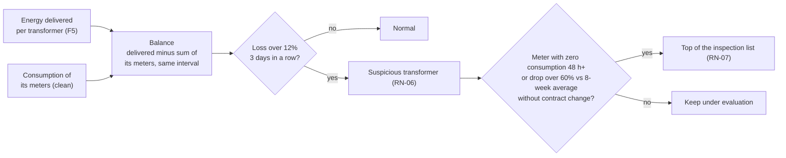
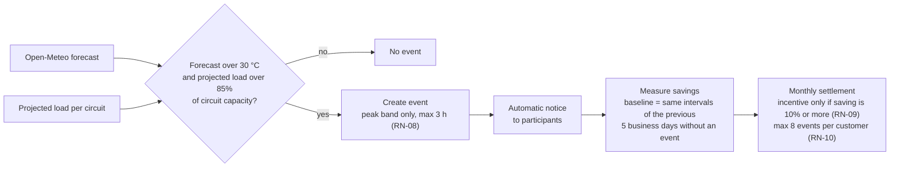

# Components and data flows

This page lists every component of v1, how they talk to each other (synchronous or asynchronous) and what runs when.

## Components

| Component | Responsibility | Runs on | Talks to | Owner |
|---|---|---|---|---|
| Seed | Populates the F4 inventory and generates simulated data with a fixed seed and a configurable defect rate | Container (on demand) | RDS | P1 |
| Concentrator simulator (F3) | Publishes one JSON message per concentrator every 30 min; can simulate an outage and a bulk resend | ECS Fargate | RabbitMQ | P1 |
| Transformer metering API (F5) | Returns energy delivered per transformer every 15 min; can inject losses | ECS Fargate behind ALB | RDS | P1 |
| RabbitMQ | Buffers readings between producers and consumers; also the Celery broker for Airflow | Container (Amazon MQ in AWS, *proposed*) | Simulator, consumers, Airflow | P1 / P3 |
| Reading consumers | Store every message as received in S3 raw, then ACK | ECS Fargate | RabbitMQ, S3 | P1 |
| Pull jobs | Fetch F5, F6 and F7 into S3 raw on schedule | Airflow tasks | F5, Open-Meteo, S3 | P2 |
| Spark jobs | Clean, dedup, estimate, tariff bands, losses, demand-response events | ECS Fargate (one task per run) | S3, RDS | P2 |
| Airflow | Schedules and retries every batch process (DAGs) | ECS (scheduler, webserver, Celery workers) | Spark tasks, pull jobs, RabbitMQ | P3 |
| RDS PostgreSQL | F4 inventory and the aggregated results the APIs serve | RDS | Seed, Spark, APIs | P1 / P3 |
| S3 data lake | raw, clean and curated layers in Parquet, with lifecycle rules for 3-year retention | S3 | Consumers, Spark, Power BI | P2 / P3 |
| Customer consumption API | Daily consumption per band for the authenticated customer (p95 of 500 ms or less) | ECS Fargate behind ALB | RDS | P1 |
| Control center API | Aggregated load per transformer | ECS Fargate behind ALB (or EKS, see [ADR-006](../adr/adr-006-container-runtime.md)) | RDS | P1 |
| Dimensional model and Power BI | Answers the six business questions | Power BI Desktop / Service | S3 curated | P4 |
| CI/CD | Lint, tests, secret scanning, image build and deploy | GitHub Actions | GitHub, ECR, ECS | P3 |
| Observability | Logs, metrics (queue depth, daily close duration) and at least one alarm | CloudWatch | Every component | P3 |

## Synchronous vs asynchronous

| Interaction | Type | Why |
|---|---|---|
| Simulator → RabbitMQ → consumers | **Asynchronous** (messaging) | Producers and consumers run at different speeds; the queue absorbs a 48,000-reading resend without losing data. |
| Airflow → Spark jobs and pull jobs | **Asynchronous** (scheduled batch) | Heavy work runs on a schedule with retries, not on user requests. |
| Spark → S3 / RDS | **Asynchronous** (batch writes) | Results are written at the end of each job; nobody waits on them in real time. |
| Pull job → F5 API, Open-Meteo | **Synchronous** (HTTP request/response) | The job needs the answer to store it; it retries on failure. |
| Customer → Customer consumption API | **Synchronous** (HTTP + JWT) | A person is waiting for the answer (p95 of 500 ms or less), so it reads pre-aggregated data from RDS. |
| Operator → Control center API | **Synchronous** (HTTP + JWT) | Same: reads pre-aggregated load per transformer, refreshed every 30 minutes; overload alerts are raised by the 30-minute process. |
| Power BI → S3 curated | **Synchronous** on refresh | The dataset is refreshed after the daily close. |

## Main flows

### 1. Reading ingestion (every 30 minutes)

- Live readings and bulk resends use **separate queues**, so a resend does not delay live traffic.
- A repeated `message_id` is ignored; business duplicates (same meter and interval) are resolved later in Spark (RN-02).

### 2. Daily close (under 45 minutes)

Writing by partition (overwrite date D) makes the close idempotent: re-running it for the same day gives the same result.

### 3. Customer consumption query

### 4. Losses detection (daily)

Example: 100 kWh delivered and 95 kWh recorded is a 5% loss (normal); 100 delivered and 85 recorded is 15%, and after 3 days the transformer is suspicious.

### 5. Demand-response event (every 30 minutes)

- **Savings** = baseline minus actual consumption in the event intervals.
- Example: a customer who saves 8% gets no incentive; one who saves 11% does.
- This replaces coordination by email with a traceable process.

## What runs when

| Frequency | Process |
|---|---|
| Continuous / every 30 min | Reading ingestion; incremental validation of the last window; demand-response evaluation |
| Every 15 min | F5 transformer energy capture |
| Hourly | Open-Meteo forecast capture |
| Daily | Daily close (under 45 min); losses and suspect meters; F4 inventory refresh |
| Monthly | Consumption per band and customer, estimated-readings check (no automatic bill above 10% estimated, inspection order instead, RN-04); incentive settlement |
| Quarterly | Regulatory report; tariff calendar update (F7) |
| On demand | F1 historical load; reprocessing a period (idempotent); bulk-resend absorption; seed, heat-wave and loss-injection demos |

## Key questions answered by this design

| Question | Answer in v1 |
|---|---|
| How do we guarantee zero lost readings on a bulk resend? | Persistent messages, publisher confirms, manual ACK after storing, a separate resend queue and a DLQ. Consumers scale out while the resend queue is long. |
| Where are duplicates and bad clocks fixed? | In Spark, not at ingestion, so raw data stays intact and periods can be reprocessed. |
| How does the API stay under 500 ms (p95)? | It reads pre-aggregated daily data from RDS, never raw readings. |
| How do we keep 3 years of readings cheaply? | S3 in Parquet with lifecycle rules to cheaper storage classes for older partitions. |
| What changes to reach 200,000 meters? | More consumer tasks, larger Spark tasks and more partitions; RabbitMQ is reviewed against Kafka at that volume (see [ADR-001](../adr/adr-001-ingestion-broker.md)). |
| How is a reprocess made safe? | Every job overwrites its own date partition and upserts by natural key. |