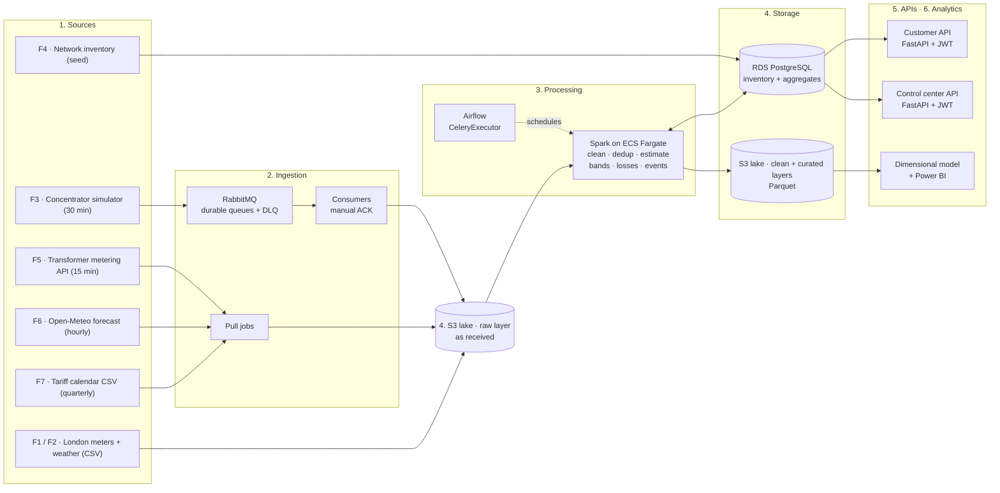

# Logical architecture (v1)

> **Status:** v1 draft for team review (T-09.4). Decisions marked *Proposed* in the [ADRs](../adr/index.md) are confirmed or changed in that review.

VoltiaGrid receives smart-meter readings every 30 minutes, cleans and completes them, assigns every interval to a tariff band, detects non-technical losses per transformer and runs demand-response events. Results are served through APIs and a Power BI dashboard, and the whole platform runs on AWS.

## Business objectives and scope

| # | Objective | How the architecture supports it |
|---|---|---|
| 1 | Bill 99% of pilot customers with actual readings by time band | Every reading is stored without loss, cleaned with documented rules (RN-01 to RN-03) and assigned to its tariff band (RN-05). |
| 2 | Identify 70% of non-technical losses at transformer level | Energy delivered per transformer (F5) is balanced against its meters every day (RN-06, RN-07). |
| 3 | Run demand-response events with measured savings | Events are triggered automatically from forecast and load, and savings are measured against a baseline (RN-08 to RN-10). |
| 4 | A platform sized and costed for 200,000 meters | Same architecture for pilot and target; only task counts and sizes change. |

**Out of scope:** remote disconnection and reconnection, bill issuance, and machine-learning demand forecasting.

## What each area receives

| Area | Deliverable |
|---|---|
| Billing | Monthly consumption per customer and time band, with the % of estimated readings visible |
| Control center | Load per transformer and overload alerts, updated every 30 minutes |
| Losses department | Prioritized list of suspicious transformers and meters to inspect first |
| Residential customers | Their own daily consumption and event participation (they only see their own data) |
| Regulator | Quarterly report on losses and metering quality |
| Management | Power BI dashboard answering six business questions, reconciled with control queries |

## Sizing

| Scenario | Meters | Readings per day (48 per meter) |
|---|---|---|
| Pilot | 5,500 | 264,000 |
| Projected (next year) | 200,000 | 9,600,000 |
| Bulk resend after a 24 h outage | 1,000 | 48,000 at once |

The architecture is sized for the pilot and must scale to the projected volume without a redesign (36 times more readings).

| Cost indicator | Pilot | Target |
|---|---|---|
| Estimated monthly AWS cost (USD) | $297 | $762 |
| Cost per meter per month (USD) | $0.054 | $0.0038 |

36 times more meters for about 2.6 times the cost; cost per meter drops by about 93%. Identified optimizations could bring the pilot to about $220 a month. These are **preliminary figures** based on AWS us-east-1 list prices and must be validated with the AWS Pricing Calculator (see Costs).

## Logical diagram

The diagram reads left to right. Each box is a logical layer; the technology used in v1 is shown inside it.

**7. Operations** is cross-cutting and applies to every layer above: GitHub Actions (lint, tests, secret scanning, image build), ECR, IAM with least privilege, VPC, resource tags, and CloudWatch logs, metrics and alarms.

## Layers

| # | Layer | What it does | v1 technology | Repository |
|---|---|---|---|---|
| 1 | **Sources** | Produce the data. F1, F2 and F6 are real; F3, F4, F5 and F7 are simulated by a reproducible seed. | CSV (Kaggle), Open-Meteo, Python simulators | `voltiagrid-api` |
| 2 | **Ingestion** | Receive readings without losing any, and bring the other sources into the lake. | RabbitMQ (persistent messages, manual ACK, DLQ), consumers, pull jobs | `voltiagrid-api` |
| 3 | **Processing** | Clean, deduplicate, estimate gaps, assign tariff bands, compute losses and settle demand-response events. | Spark on ECS Fargate, orchestrated by Airflow | `voltiagrid-data` |
| 4 | **Storage** | Keep every reading for 3 years at the lowest cost, plus the operational data the APIs need. | S3 (raw, clean, curated) in Parquet; RDS PostgreSQL | `voltiagrid-data`, `voltiagrid-api` |
| 5 | **APIs** | Serve daily consumption to the authenticated customer and transformer load to the control center. | FastAPI, JWT, behind an ALB | `voltiagrid-api` |
| 6 | **Analytics** | Answer the six business questions with numbers that reconcile with a control query. | Dimensional model, Power BI | `voltiagrid-analytics` |
| 7 | **Operations** | Build, deploy, secure and observe everything. | GitHub Actions, ECR, ECS/EKS, IAM, CloudWatch | all |

## Design principles

- **Never lose a reading.** Messages are persistent and the consumer acknowledges only after the reading is stored (RNF-03).
- **Keep raw data untouched.** Business duplicates and defects are fixed in Spark, not at ingestion, so any period can be reprocessed.
- **Idempotent everything.** Re-running the seed, a Spark job or a reprocess never duplicates or corrupts data.
- **Same code everywhere.** Local and AWS differ only in environment variables (`DATABASE_URL`, bucket names).
- **No secrets in code or images.** Configuration through environment variables; CI fails if a secret is detected (CT-02).
- **Pay for what runs.** Batch work runs on Fargate tasks that stop when the job ends.

## Related pages

- [Components and data flows](./components-and-flows.md)
- [Architecture decision records](../adr/index.md)