# Dimensional model (draft)

> US-10 (KAN-84), T-10.1. Star schema built by Spark in the **S3 curated** layer and read by Power BI. Draft for team review: names and grains may change when the Spark jobs exist.

## Design choices

- **Star schema:** five fact tables that share the same dimensions (conformed dimensions), so every visual can be filtered by date, customer, meter or transformer.
- **Grain first:** every fact table declares what one row means before listing measures.
- **Surrogate keys** (`*_key`) in every dimension; the natural keys from F4 (`code`, `lclid`) are kept as attributes.
- **History where it matters:** `dim_customer` and `dim_tariff_band` keep versions by effective date (slowly changing dimension type 2), because RN-05 needs the tariff valid on each date and RN-07 needs to know whether the contract changed.
- **Source of truth:** dimensions come from F4 (inventory), F7 (tariff calendar) and F2/F6 (weather); facts come from the clean readings and the results of the business rules.

## Star schema

```mermaid
erDiagram
  DIM_DATE ||--o{ FACT_CONSUMPTION : "date_key"
  DIM_TIME_OF_DAY ||--o{ FACT_CONSUMPTION : "time_key"
  DIM_METER ||--o{ FACT_CONSUMPTION : "meter_key"
  DIM_CUSTOMER ||--o{ FACT_CONSUMPTION : "customer_key"
  DIM_TRANSFORMER ||--o{ FACT_CONSUMPTION : "transformer_key"
  DIM_TARIFF_BAND ||--o{ FACT_CONSUMPTION : "band_key"

  DIM_DATE ||--o{ FACT_TRANSFORMER_LOSS_DAILY : "date_key"
  DIM_TRANSFORMER ||--o{ FACT_TRANSFORMER_LOSS_DAILY : "transformer_key"

  DIM_DATE ||--o{ FACT_LOAD_WEATHER_HOURLY : "date_key"
  DIM_TRANSFORMER ||--o{ FACT_LOAD_WEATHER_HOURLY : "transformer_key"

  DIM_DR_EVENT ||--o{ FACT_DR_PARTICIPATION : "event_key"
  DIM_CUSTOMER ||--o{ FACT_DR_PARTICIPATION : "customer_key"
  DIM_DATE ||--o{ FACT_DR_PARTICIPATION : "date_key"

  DIM_CUSTOMER ||--o{ FACT_BILLING_MONTHLY : "customer_key"
  DIM_METER ||--o{ FACT_BILLING_MONTHLY : "meter_key"
  DIM_MONTH ||--o{ FACT_BILLING_MONTHLY : "month_key"
  DIM_EXCLUSION_REASON ||--o{ FACT_BILLING_MONTHLY : "reason_key"

  FACT_CONSUMPTION {
    decimal energy_kwh
    decimal energy_cost
    int is_estimated
    string estimation_method
  }
  FACT_TRANSFORMER_LOSS_DAILY {
    decimal delivered_kwh
    decimal metered_kwh
    decimal loss_kwh
    decimal loss_pct
    decimal loss_cost
    int is_suspicious
  }
  FACT_LOAD_WEATHER_HOURLY {
    decimal delivered_kwh
    decimal load_pct_capacity
    decimal temperature_c
  }
  FACT_DR_PARTICIPATION {
    decimal baseline_kwh
    decimal actual_kwh
    decimal savings_kwh
    decimal savings_pct
    int incentive_paid
    decimal incentive_amount
  }
  FACT_BILLING_MONTHLY {
    decimal total_kwh
    int total_readings
    int estimated_readings
    decimal estimated_pct
    int is_billable
    int inspection_order
  }
```

## Fact tables

| Fact table | Grain (one row is…) | Measures | Built from | Rules |
|---|---|---|---|---|
| `fact_consumption` | one **meter** in one **30-minute interval** | `energy_kwh`, `energy_cost` (kWh × band price), `is_estimated` (0/1), `estimation_method` (none, interpolation, profile) | Clean readings (S3 clean) + F7 | RN-01, RN-02, RN-03, RN-05 |
| `fact_transformer_loss_daily` | one **transformer** on one **day** | `delivered_kwh`, `metered_kwh`, `loss_kwh`, `loss_pct`, `loss_cost`, `consecutive_days_over_12`, `is_suspicious` (0/1) | F5 + sum of `fact_consumption` | RN-06, RN-07 |
| `fact_load_weather_hourly` | one **transformer** in one **hour** | `delivered_kwh`, `peak_kw`, `load_pct_capacity`, `temperature_c` | F5 + F2/F6 | RN-08 input |
| `fact_dr_participation` | one **customer** in one **demand-response event** | `baseline_kwh`, `actual_kwh`, `savings_kwh`, `savings_pct`, `incentive_paid` (0/1), `incentive_amount` | Events + `fact_consumption` | RN-08, RN-09, RN-10 |
| `fact_billing_monthly` | one **customer** (meter) in one **month** | `total_kwh`, `total_readings`, `estimated_readings`, `estimated_pct`, `is_billable` (0/1), `inspection_order` (0/1) | Aggregate of `fact_consumption` | RN-04 |

## Dimensions

| Dimension | Grain | Main attributes | Source | History |
|---|---|---|---|---|
| `dim_date` | one day | `date`, `day_of_week`, `is_business_day`, `month`, `quarter`, `year` | Generated | No |
| `dim_month` | one month | `year_month`, `month_name`, `quarter`, `year` | Generated (roll-up of `dim_date`) | No |
| `dim_time_of_day` | one 30-minute slot (48 per day) | `slot` (0–47), `hh_mm`, `hour` | Generated | No |
| `dim_tariff_band` | one band version | `band_name` (peak, intermediate, off-peak), `price_per_kwh`, `valid_from`, `valid_to` | F7 | Type 2 by effective date |
| `dim_customer` | one customer contract version | `customer_code`, `acorn_group`, `acorn_grouped`, `tariff_type` (standard, dynamic), `contract_code`, `valid_from`, `valid_to`, `is_current` | F4 (`customer`, `contract`) | Type 2 on contract change |
| `dim_meter` | one meter | `lclid`, `customer_code`, `transformer_code` | F4 (`meter`) | No |
| `dim_transformer` | one transformer | `transformer_code`, `capacity_kva`, `circuit_code`, `circuit_capacity_kva` | F4 (`transformer`, `circuit`) | No |
| `dim_dr_event` | one event | `event_id`, `circuit_code`, `start_ts`, `end_ts`, `duration_h`, `forecast_temp_c`, `projected_load_pct` | Demand-response job | No |
| `dim_exclusion_reason` | one reason | `reason_code`, `description` (estimated readings over 10%, suspicious meter, no readings, invalid clock) | Static list | No |

## Bus matrix

Which dimensions each fact uses:

| Fact \ Dimension | date | month | time of day | tariff band | customer | meter | transformer | DR event | exclusion reason |
|---|---|---|---|---|---|---|---|---|---|
| `fact_consumption` | ✔ | | ✔ | ✔ | ✔ | ✔ | ✔ | | |
| `fact_transformer_loss_daily` | ✔ | | | | | | ✔ | | |
| `fact_load_weather_hourly` | ✔ | | (hour) | | | | ✔ | | |
| `fact_dr_participation` | ✔ | | | | ✔ | | | ✔ | |
| `fact_billing_monthly` | | ✔ | | | ✔ | ✔ | | | ✔ |

## Volumes (pilot)

| Table | Rows |
|---|---|
| `fact_consumption` | about 264,000 per day (5,500 meters × 48) |
| `fact_transformer_loss_daily` | about 100 per day |
| `fact_load_weather_hourly` | about 2,400 per day |
| `fact_billing_monthly` | about 5,500 per month |

`fact_consumption` is partitioned by date in Parquet; Power BI imports aggregates and uses DirectQuery or aggregation tables only if the import gets too large.

## Open points

- `fact_load_weather_hourly` at transformer level or circuit level (RN-08 evaluates circuit capacity).
- Currency and rounding of `energy_cost`, `loss_cost` and `incentive_amount` (taken from F7 prices).
- Whether `dim_meter` and `dim_customer` merge, since the pilot has one meter per customer.

See the [business questions matrix](./business-questions-matrix.md) for how each question maps to these tables.