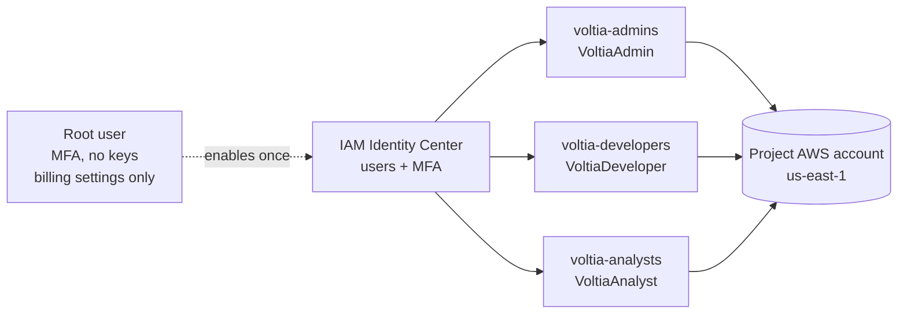

# AWS account and access

> US-08 (KAN-82). How the team signs in to AWS, what each person can do, how resources are tagged and how spend is controlled. No account IDs, access keys or emails are published on this page.

## Account

| Item | Value |
|---|---|
| Account type | One AWS account owned by the team, used as the AWS Organizations management account |
| Default region | `us-east-1` (same region used for the cost estimate) |
| Identity | AWS IAM Identity Center (see [ADR-009](../adr/adr-009-aws-identity.md)) |
| Environments | `dev` for the project; `prod` only for the final demo |

## Root account rules

The root user (the email that created the account) is **not used for daily work**.

- MFA enabled on the root user.
- No access keys for the root user.
- Root is used only for tasks that require it: account and billing settings, and closing the account.
- Root credentials are kept by the account owner (P3); nobody shares them.

## Individual access with MFA

Every member signs in with **their own user** in IAM Identity Center through the AWS access portal. MFA is required at every sign-in, and a user without an MFA device must register one the first time.

### Groups and permission sets

| Group | Members | Permission set | AWS policy | Why |
|---|---|---|---|---|
| `voltia-admins` | P3 (Cloud & DevOps) | `VoltiaAdmin` | `AdministratorAccess` | Creates the network, IAM roles, ECS, EKS and pipelines |
| `voltia-developers` | P1 (Backend), P2 (Data) | `VoltiaDeveloper` | `PowerUserAccess` | Works with ECS, ECR, S3, RDS, Amazon MQ and CloudWatch, but **cannot create or change IAM users, groups or roles** |
| `voltia-analysts` | P4 (Architecture & analytics) | `VoltiaAnalyst` | `ReadOnlyAccess` + `job-function/Billing` | Reads every resource for documentation and manages budgets and cost reports |

- Permission sets use a session duration of **8 hours**.
- Access is reviewed at the end of each sprint; when someone leaves the team, their user is disabled the same day.
- `PowerUserAccess` is the starting point. If a developer only needs a few services, the permission set is narrowed later and the change is recorded here.

### Who does what



## AWS CLI with profiles

Every member uses **AWS CLI v2** with a named profile linked to their permission set. Credentials are temporary (they expire with the session), so there are no long-lived access keys on laptops.

| Profile | Permission set | Used by |
|---|---|---|
| `voltia-admin` | `VoltiaAdmin` | P3 |
| `voltia-dev` | `VoltiaDeveloper` | P1, P2 |
| `voltia-analyst` | `VoltiaAnalyst` | P4 |

Set up once:

```bash
aws configure sso
# SSO session name: voltia
# SSO start URL: <AWS access portal URL, shared privately>
# SSO region: us-east-1
# Choose the account and the role (permission set)
# Default region: us-east-1, output: json
# Profile name: voltia-dev (or voltia-admin / voltia-analyst)
```

Daily use:

```bash
aws sso login --profile voltia-dev
aws sts get-caller-identity --profile voltia-dev
```

`get-caller-identity` must show an assumed role named after the permission set (for example `AWSReservedSSO_VoltiaDeveloper_...`), never the root user.

**CI/CD** does not use personal credentials. GitHub Actions will assume an IAM role through OpenID Connect (OIDC) when deployments are added.

## Tagging policy

Every resource that supports tags must have these tags. They are activated as **cost allocation tags**, so spend can be split by project, environment and owner.

| Tag key | Allowed values | Example |
|---|---|---|
| `Project` | `voltiagrid` | `voltiagrid` |
| `Environment` | `dev`, `prod` | `dev` |
| `Owner` | `p1-backend`, `p2-data`, `p3-devops`, `p4-analytics` | `p2-data` |
| `Component` | free text, short | `api-customer`, `spark-daily-close` |

- Untagged resources are reported in the sprint review and fixed or deleted.
- Infrastructure created with code (Terraform or CloudFormation) applies these tags by default.

## Budget and alerts

| Setting | Value |
|---|---|
| Budget type | Cost budget, monthly, recurring |
| Amount | Agreed by the team for the development phase (see Costs) |
| Alert 1 | **Actual** spend over 50% of the budget |
| Alert 2 | **Actual** spend over 80% of the budget |
| Alert 3 | **Forecasted** spend over 100% of the budget |
| Recipients | The four team members' emails |

Also enabled:

- **AWS Free Tier usage alerts** (Billing preferences).
- **Cost Anomaly Detection** monitor for AWS services, with a daily email summary.

When an alert arrives, P3 checks Cost Explorer by tag and the owner of the resource stops or deletes what is not needed.

## Evidence checklist

- [ ] Root user has MFA and no access keys.
- [ ] Four users exist in IAM Identity Center, each in one group.
- [ ] MFA is required at every sign-in.
- [ ] Each member ran `aws sts get-caller-identity` with their profile (screenshot without the account ID).
- [ ] Budget with the three alerts exists and the four emails are subscribed.
- [ ] `Project`, `Environment`, `Owner` and `Component` are activated as cost allocation tags.